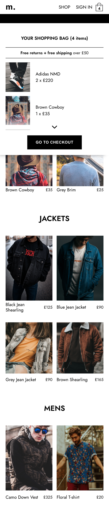

# Online-Shop

This is a basic fashion online-shop built with React functional components and Redux.

## Overview

### User journeys

Users should be able to:

- See main page with navigation
- See "Shop page" with previews of different categories
- See category page with all items
- Add items to cart
- Increase, decrease quantity, delete item from cart
- See Checkout page and pay the order

### Screenshot

#### Desktop

|   |   |
|   |   |

#### Mobile

|   |   |   |   |

### Links

- Live Site URL: [Online-shop](https://mclub-shop.netlify.app/)

## My process

### Built with

- React
- Redux
- Firebase
- SASS
- Styled components

### Learnings + future focus

The main purpose of this project was to practice React functional components with Hooks and Redux for global state management as well as styled components instead of traditional CSS/SASS.

Possible future steps:
- Create a separate page for each item to display more details with a nice image gallery
- Add sizes throughout the website and change the global state accordingly
- Migrate codebase from JavaScript to TypeScript for learning purposes

## Author

- Github - [jane-doronina](https://github.com/jane-doronina)
- LinkedIn - [@zhanna-doronina](https://www.linkedin.com/in/zhanna-doronina/)
